### PortableWin26H2 <br />── The last exodus of legacy apps 

> "We never love anyone. What we love is the idea we have of
someone. It’s our own concept – our own selves – that we love"<br /><br />"Nunca amamos alguém. Amamos, tão-somente, a ideia que fazemos de alguém. É um conceito nosso — em suma, é a nós mesmos — que amamos."
<br/>--- The Book of Disquiet by Fernando Pessoa


#### Prologue


#### I. TL;DR
> [Windows To Go](https://en.wikipedia.org/wiki/Windows_To_Go) was a feature in Windows 8 Enterprise, Windows 8.1 Enterprise, Windows 10 Education, and Windows 10 Enterprise versions up to the November 2019 update, that allows the system to boot and run from certain USB mass storage devices such as USB flash drives and external hard disk drives which have been certified by Microsoft as compatible. It is a fully manageable corporate Windows environment. The development of Windows To Go was discontinued by Microsoft in 2019, and is no longer available in Windows 10 as of the May 2020 update (version 2004).

> It was intended to allow enterprise administrators to provide users with an imaged version of Windows that reflects the corporate desktop. Although creation of Windows To Go drives was not officially supported by non-Enterprise (or Education) editions of Windows 8.x and 10, some information has been published describing various ways to install Windows To Go using any edition of Windows 8.x and 10 and any bootable USB device.

> After the release of the May 2019 update (version 1903) for Windows 10, Microsoft announced that Windows To Go was no longer being developed. Microsoft stated in its discontinuation statement that "WTG does not support feature updates. Therefore, it does not enable you to stay current. Additionally, WTG requires a specific type of USB drive that many OEMs no longer support." Windows To Go has been removed in Windows 10 starting with the May 2020 update (version 2004).

[**Why is the Windows To Go media creation process so slow?**](https://github.com/pbatard/rufus/wiki/FAQ#user-content-Why_is_the_Windows_To_Go_media_creation_process_so_slow)

> It simply means that your media is **not** suited to run Windows To Go. You will need to go purchase an SSD-based USB drive, that has a **random access write** speed (rather than a sequential access write speed, which is what manufacturers usually advertises) that is actually high enough to run Windows. There is **no** alternative to getting a better suited media.

> That is because, creating a Windows To Go drive means the creation of a lot of random small files (as opposed to creating a Windows installation drive, where one mostly need to copy a large sequential file and a relatively low number of small files), and, whereas *a flash drive might report very good write speed, that high write speed might only apply to sequential access and not random file access*, which the WIM extraction that is applied when creating a Windows To Go drive, relies on.

> As a result, even if you have a drive that can allegedly sustain 100 MB/s **sequential write** speeds, the effective maximum write speed the same drive can achieve for writing the kind of small files needed during the creation of a Windows To Go drive could be much much lower, especially with non SSD-based consumer flash drives. *And that speed reflects the speed at which Windows will be able to run from the same drive, since it too will need to read and write lots of small non sequential files at a high enough speed.*

> A decent rule of thumb is as follows: *If your Windows To Go creation process takes more than 20 minutes, then it means that the media you are trying to use is ill-suited to actually run Windows.* There is no workaround, besides using a media with faster random I/O speed.

> The one thing we know of that **may** help speed up the creation of a Windows To Go drive, is to temporarily disable your Anti Virus. But you shouldn't expect a dramatic speed improvement out of it when the underlying issue is that your drive's effective random write speed is way too low to run Windows in the first place.

[**Frequently Asked Questions (FAQ)**](https://github.com/pbatard/rufus/wiki/FAQ)

> To create your Windows To Go drive, you should try to use a version of Windows that it at least the same version as the one of the ISO you are trying to create a To Go drive from. This means that, if you want to create a `Windows 8.1 To Go drive`, you should run Rufus on `Windows 8.1`, `Windows 10`, or a later version of Windows. Trying to create a `Windows 8.1` To Go drive on `Windows 8.0`, for instance, is **unsupported** and will likely result in errors during creation.

> The Windows To Go option may not be available with all Windows images, **especially the ones created with the Windows 10 Media Creation Tool**. This is because Microsoft tools can create ISOs containing an `install.wim` that is incompatible with Microsoft's own WIM extraction APIs (which is what Rufus uses). If that is the case, you will see a line in the log that states:
```
Note: This WIM version is NOT compatible with Windows To Go.
```

> For more technical details on how Windows To Go is currently implemented in Rufus, see [here](https://github.com/pbatard/rufus/wiki/Usage-Notes#Windows_To_Go).

**Can I create a Windows To Go drive using a Windows To Go drive?**

> AI: Yes, you can create a new Windows To Go drive while running from an existing Windows To Go drive. While doing so introduces specific performance, hardware, and software constraints compared to using a standard internal OS.


#### II. 
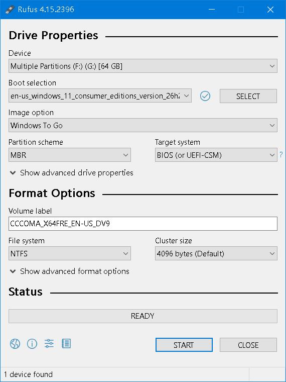

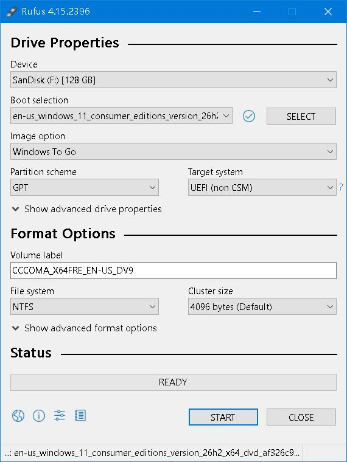

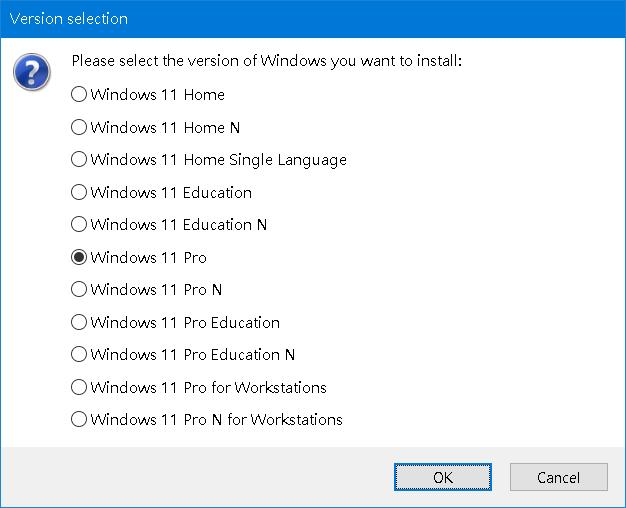

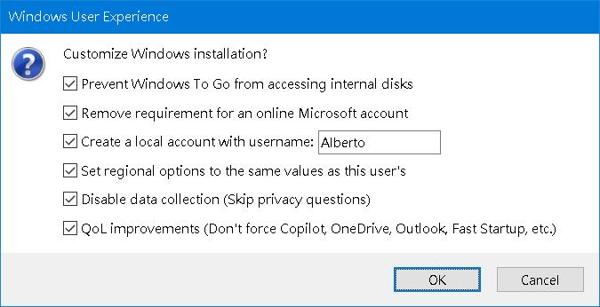

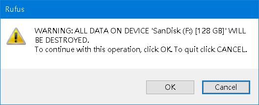


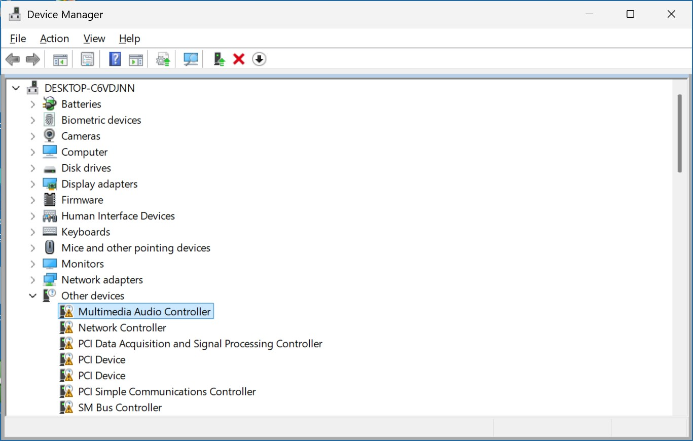

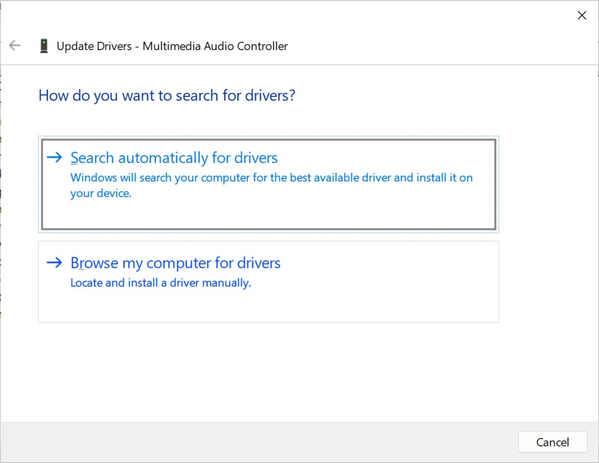

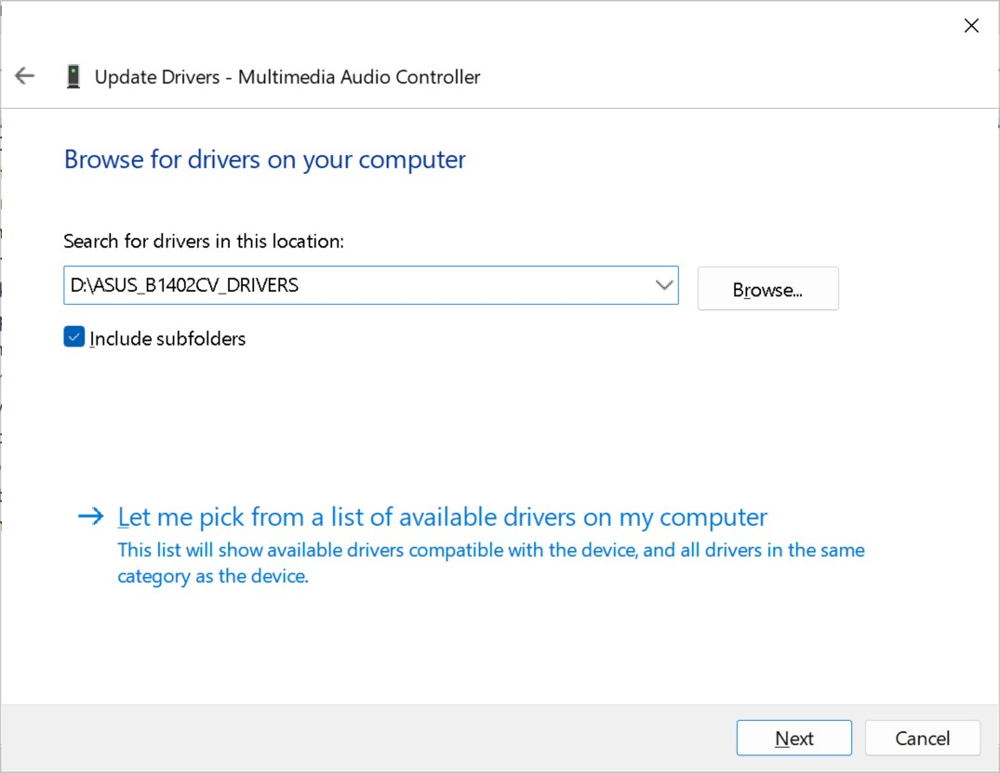

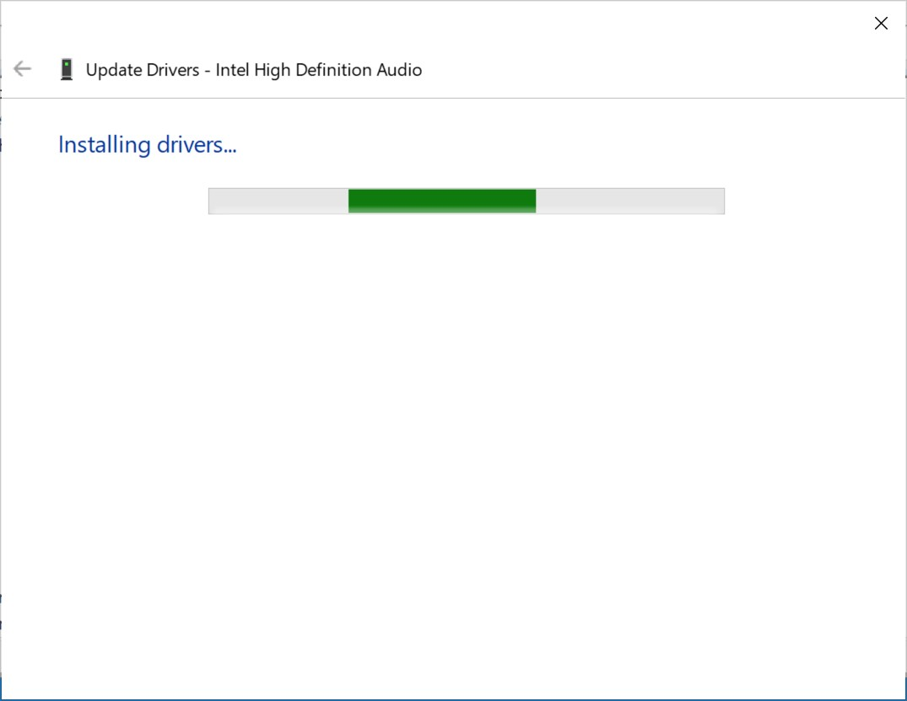

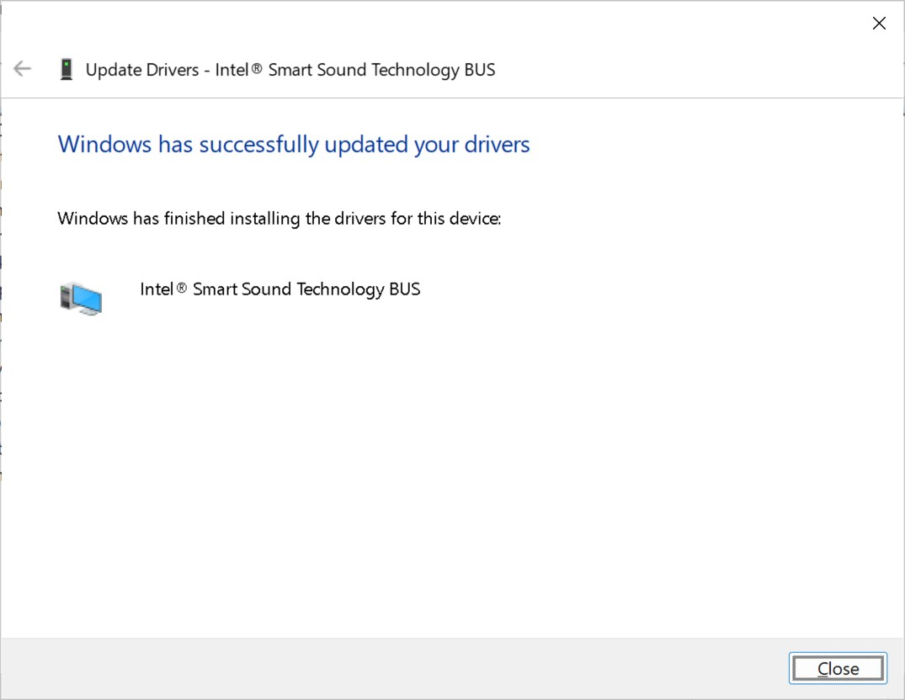

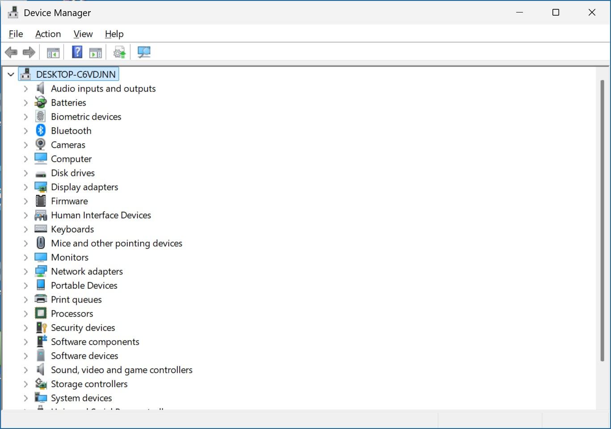


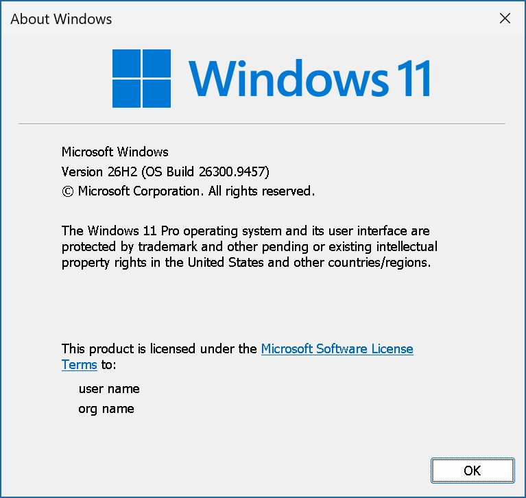

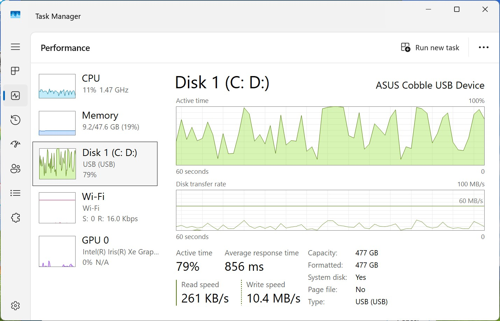

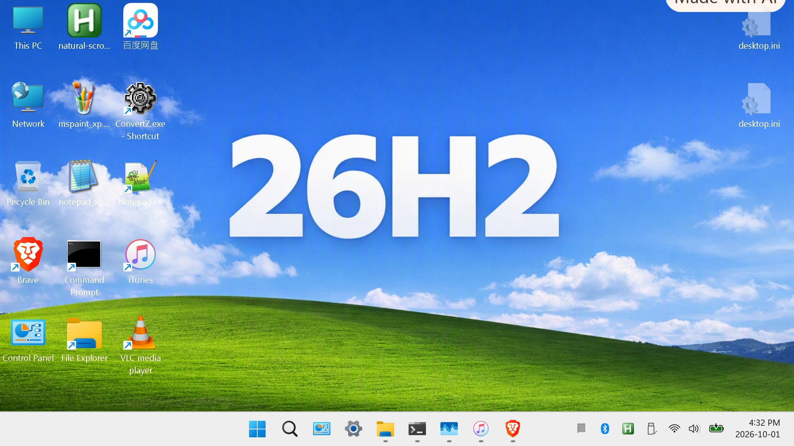


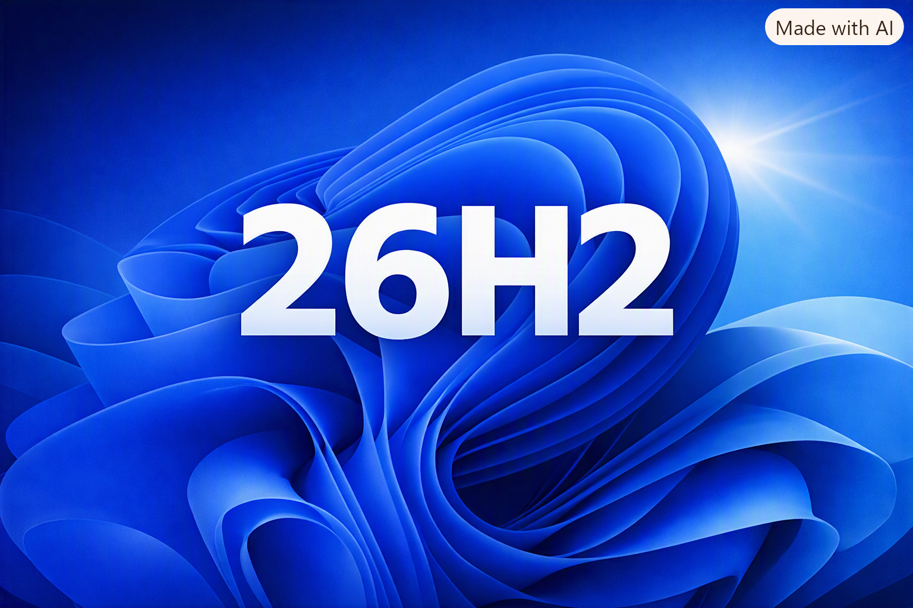

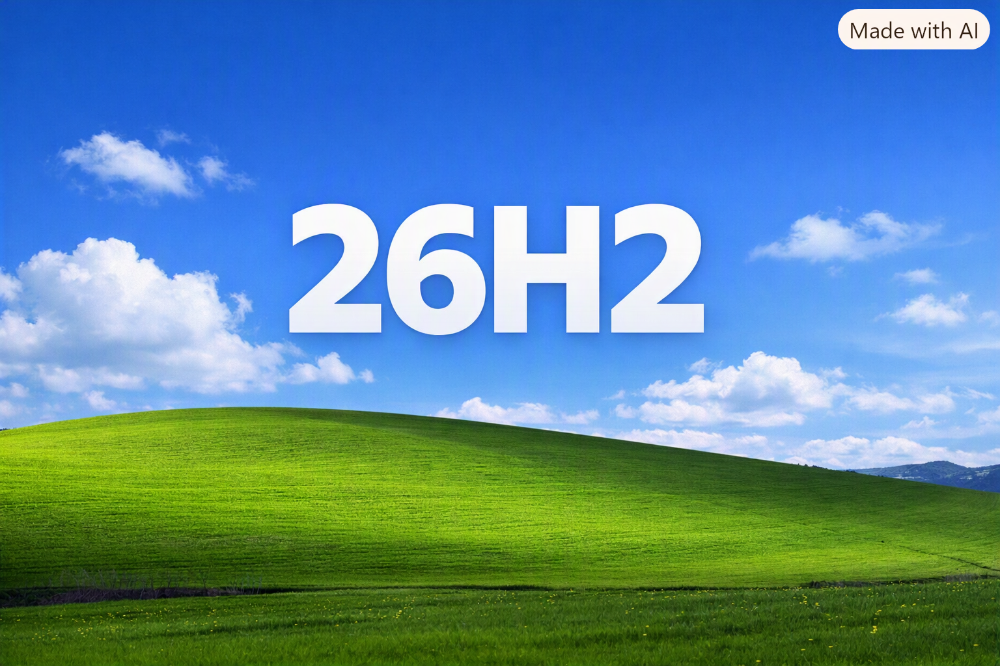

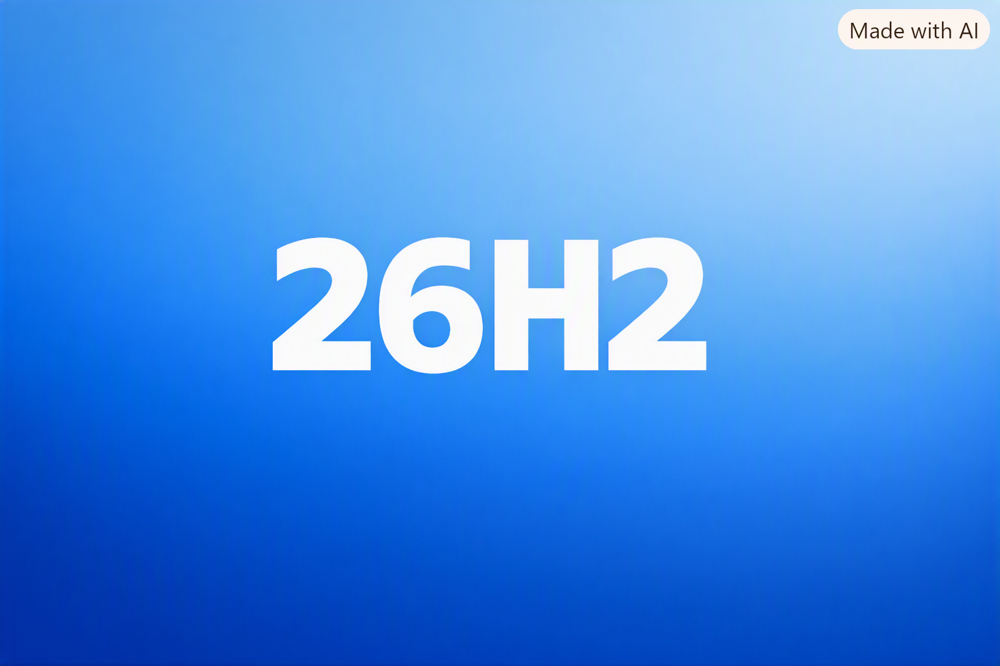


#### III. Bibliography 
1. [Rufus](https://rufus.ie/en/)
2. [Open-Shell](https://github.com/Open-Shell/Open-Shell-Menu)
3. [Desktop Restore](https://www.majorgeeks.com/files/details/desktop_restore.html)
4. [Ventoy](https://www.ventoy.net/en/index.html)
5. [The Book of Disquiet by Fernando Pessoa](./The%20Book%20of%20Disquiet%20-%20Fernando%20Pessoa.pdf)


#### Epilogue 

A: What is the *biggest* legacy app in your computer? 

B: Windows itself... i think. 


#### EOF (2026/10/30)
